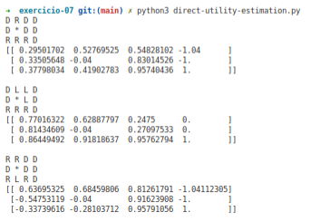
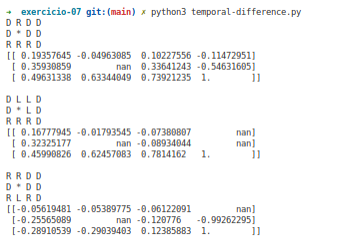

# Reinforcement Learning - Passive Algorithms

## Passive learning
- The agent acts based on a fixed policy $π$ and tries to learn how good the policy is by observing the world.
- Analogous to policy evaluation in policy iteration.

## Algorithms
Three policies were used, the first is an optimal policy that was obtained by the value iteration algorithm, the next 2 are random policies. To execute these algorithms, they can do it in the following way.
### Direct Utility Estimation

### Temporal Difference

**Contributors**
  - Percy Maldonado
  - Jesamin Zevallos
  - Alexis Mendoza